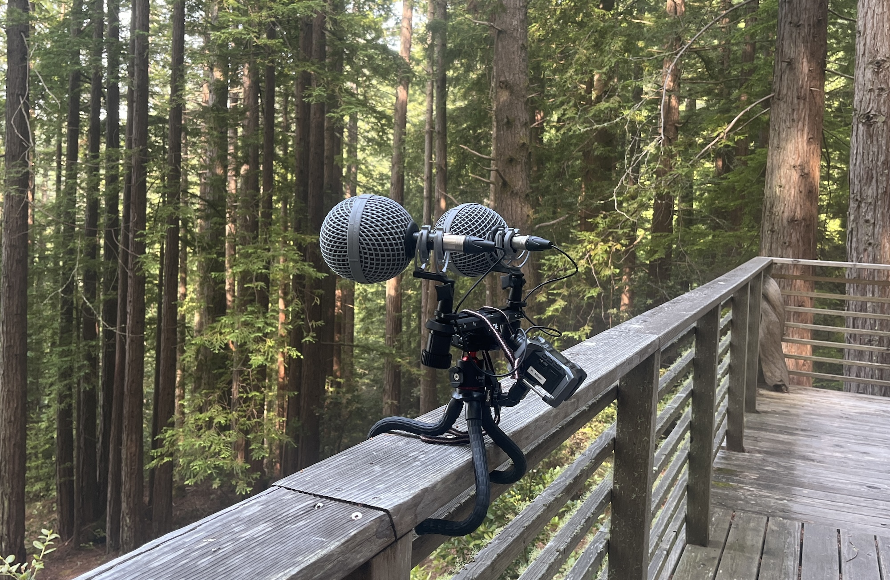

<!--  -->

**Instructor:** Philip Meyer
<philip@inter-modal.com> (until 10/1)
<philipmeyer@g.ucla.edu> (after 10/1)
**Teaching Assistant:** Roxanne Harris
**Location:** Broad Art Center Room 4230
**Time:** Tues / Thurs 2 - 5
**Office Hours:** T/Th 1-2 (email first!)








