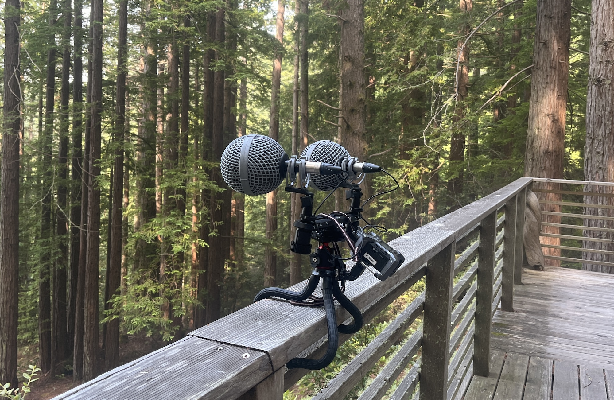

<!--  -->

**Instructor:** Philip Meyer
<philip@inter-modal.com> (until 10/1)
<philipmeyer@g.ucla.edu> (after 10/1)
**Teaching Assistant:** Roxanne Harris
**Location:** Broad Art Center Room 4230
**Time:** Tues / Thurs 2 - 5
**Office Hours:** T/Th 1-2 (email first!)e

//prettier-ignore




<!--  //prettier-ignorekk -->
<!--  -->



- Drive: <https://drive.google.com/drive/folders/188lOGAjp0zY80gEe-PjdlwD4kL35hD1B?usp=drive_link>
- Assignment Submission: <https://forms.gle/7Uf5w3y2m3b3xjtA6>
